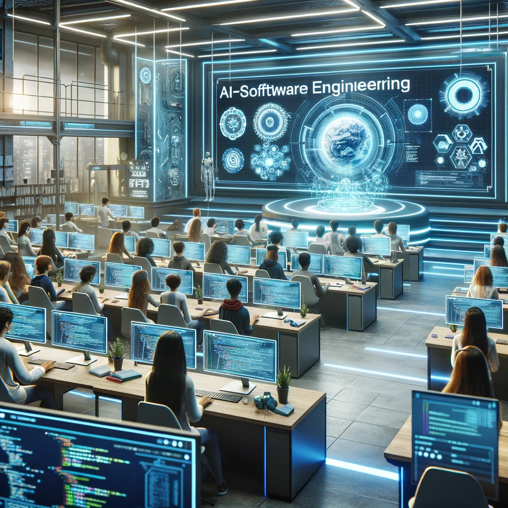

# Reflecting On The Use of AI During My Journey In ICS 314

## I. Introduction

### The Evolution and Impact of AI in Software Engineering Education
The advent of Artificial Intelligence (AI) has catalyzed a transformative shift in pedagogical methodologies and learning experiences. My personal exploration of AI began well before its mainstream surge, offering me a unique perspective on its evolution and growing ubiquity in various aspects of life. In the context of courses like ICS 314, AI tools such as ChatGPT, Bard, and Co-Pilot have transcended the role of mere digital tools, becoming integral to the learning ecosystem. These AI platforms, with their advanced capabilities in processing and presenting information, have revolutionized the way complex software engineering concepts are taught and understood. They serve not only as repositories of knowledge but as interactive, adaptive learning partners that enhance coding practices, simplify problem-solving processes, and personalize educational experiences. This integration of AI in software engineering education mirrors the opening of Pandora's box – an irreversible step into a new era where the boundaries of technology and education are continually expanded and redefined. As these AI tools evolve, they not only reflect the current state of technology but also shape the future skills and adaptability of software engineers, preparing them for a constantly evolving technological landscape.
## II. Personal Experience with AI

### A. Experience WODs (E18)
In the Underscore.js functional programming WOD, I utilized ChatGPT to enhance my comprehension. It helped clarify complex concepts, making the learning process more efficient.

### B. In-class Practice WODs
ChatGPT was a resource for error checking, though I used it sparingly, mainly to understand and rectify coding mistakes.

### C. In-class WODs
When unclear about a task, I used ChatGPT to provide foundational code and functions. However, due to previous practice WODs, I could modify and adapt the AI-generated code to fit specific needs.

### D. Essays
ChatGPT played a significant role in essay writing, transforming basic bullet points and ideas into well-articulated text. It served as a tool to elevate the quality of my writing, even enabling me to achieve a Shakespearean flair, demonstrating its versatility in language usage.

### E. Final Project
For debugging, documenting code, and testing new prototypes, ChatGPT was invaluable. Its effectiveness, however, depended heavily on my understanding of what to ask and how to ask it.

### F. Learning a Concept/Tutorial
I use ChatGPT daily to grasp new concepts, making learning more interactive and accessible.

### G. Answering Questions in Class/Discord
ChatGPT helped me expand upon questions, aiding in formulating more comprehensive and insightful inquiries rather than directly providing answers.

### H. Asking/Answering a Smart-Question
I haven't used AI for this purpose yet but plan to utilize it for creating unbiased and neutral smart questions or answers.

### I. Coding Example
For understanding Underscore.js, I asked ChatGPT for examples, like using `.pluck`, which allowed me to experiment and understand the library more effectively.

### J. Explaining Code
AI was consistently used to explain code segments, aiding in my understanding and ability to articulate coding logic.

### K. Writing Code
I employed ChatGPT for prototyping and crafting routine code segments, saving time and effort.

### L. Documenting Code
After completing each function, I used ChatGPT to draft documentation, modifying it as necessary to ensure accuracy and relevance.

### M. Quality Assurance
For identifying and fixing issues, like ESLint errors, ChatGPT was a frequent go-to. It saved time and frustration in debugging and code refinement.

## III. Impact on Learning and Understanding

The integration of Artificial Intelligence in ICS 314 has profoundly influenced my approach to learning, significantly enhancing the efficiency of understanding complex software engineering principles. AI tools like ChatGPT provided immediate access to information and resources, facilitating quicker comprehension of new concepts and serving as a first line of consultation for problem-solving. This capability was invaluable in instances where immediate human assistance was not available, allowing for uninterrupted progress in learning. However, the convenience of AI also introduced the risk of over-reliance, potentially hindering deeper learning and the development of critical thinking skills. Striking a balance between utilizing AI as a learning aid and engaging in independent problem-solving was essential to avoid a superficial grasp of the subject matter.

Furthermore, the impact of AI extended to soft skills such as communication and collaboration. While AI tools helped articulate ideas clearly and efficiently, enhancing the ability to collaborate within team settings, they also underscored the importance of mindful engagement with technology. This dual role of AI highlighted the need for a balanced approach in education, where the benefits of AI are leveraged to foster not only technical understanding but also the development of critical thinking and independent analysis skills. Balancing the advantages of AI with the necessity for self-driven learning and exploration became a pivotal aspect of my educational journey in software engineering.

## IV. Practical Applications

The practical applications of AI in real-world scenarios, particularly in projects like the Hawaii Annual Code Challenge (HACC), were strikingly evident. AI's impact was multifaceted, influencing various stages of the software development cycle. Its most significant contribution was in accelerating development processes. AI tools provided instant access to a wide range of solutions and coding insights, which was invaluable in rapid prototyping and idea generation. This acceleration was not just in terms of speed but also in the breadth of innovative solutions offered. AI's ability to analyze vast datasets and suggest creative approaches often led to the discovery of unique solutions that might not have been immediately apparent through traditional brainstorming methods.

However, the effectiveness of AI in these real-world applications was not uniform. There were instances where the solutions or suggestions provided by AI required substantial human intervention to be truly effective. This was particularly noticeable in projects with highly specialized or niche requirements. In such cases, AI-generated solutions served more as a starting point rather than a definitive answer. The need to tailor these solutions to specific project needs highlighted the importance of human expertise and creativity in the software development process.

Additionally, the use of AI in real-world projects brought to light its role in enhancing team collaboration and communication. AI tools facilitated more efficient sharing of ideas and solutions among team members, fostering a collaborative environment conducive to innovation. This aspect was crucial in complex projects where different team members worked on diverse aspects of the project, requiring a cohesive integration of individual contributions.

However, relying on AI also necessitated a critical evaluation of the quality and applicability of its output. In scenarios where project requirements were dynamic or not clearly defined, AI's contributions needed to be carefully assessed and adapted. This demanded a certain level of discernment and flexibility from the human developers, ensuring that the integration of AI's capabilities complemented rather than dictated the project's trajectory.

## V. Challenges and Opportunities

One of the major challenges encountered with the use of AI in the context of software engineering education was its tendency to produce occasional inaccuracies and generic responses. This was particularly evident in situations requiring nuanced understanding or specialized knowledge. These inaccuracies, while relatively infrequent, raised concerns about the reliability of AI as a sole source of information, especially in educational settings where precision and depth of understanding are crucial. Additionally, the generic nature of some responses could sometimes lead to a lack of depth in the learning material, potentially impacting the quality of education.

However, these challenges also present significant opportunities for the evolution and refinement of AI tools. The need for AI systems that can cater more precisely to the specialized requirements of software engineering education is clear. This opens up avenues for the development of more sophisticated AI algorithms capable of understanding and responding to complex, domain-specific queries. The integration of AI into educational frameworks is still an emerging field, and these challenges serve as valuable feedback for developers and educators alike, guiding the continuous improvement of these tools.

Furthermore, the presence of inaccuracies and generic responses also provides a unique opportunity for learners to develop critical thinking and analytical skills. Encountering and identifying these inaccuracies challenges students to cross-verify information, seek multiple sources, and engage more deeply with the material. This process can foster a more active and questioning approach to learning, which is essential in a field like software engineering that constantly evolves and requires adaptability.

## VI. Comparative Analysis

When comparing traditional teaching methods with AI-enhanced approaches in the context of software engineering education, distinct advantages and limitations become apparent. AI-enhanced learning undoubtedly offers a more engaging and dynamic educational experience. The immediate access to a vast array of information, quick feedback, and the ability to interactively explore various concepts and solutions are significant benefits. This immediacy and richness of resources make learning more flexible and adaptable to individual needs, a feature particularly valuable in a fast-paced and evolving field like software engineering.

AI tools also facilitate a more personalized learning experience. They can adapt to the learner's pace and style, providing resources and explanations tailored to individual understanding levels. This level of customization is difficult to achieve in traditional classroom settings, where the one-size-fits-all approach often prevails. Furthermore, the interactive nature of AI tools can lead to higher levels of student engagement, as learners are actively involved in the process, experimenting and receiving instant feedback.

However, traditional teaching methods continue to excel in areas where AI is still catching up. One of the key strengths of conventional educational approaches is the ability to provide a nuanced understanding of complex topics. The human touch in teaching, with personal experiences, contextual insights, and the capacity for empathy and understanding, often leads to a deeper and more holistic comprehension of subject matter. Traditional methods also excel in fostering critical thinking and problem-solving skills. The interactive classroom discussions, debates, and the need to articulate and defend one's ideas are vital in developing these essential skills.

Moreover, traditional methods offer the advantage of human mentorship and guidance. The role of a teacher or a mentor in guiding, inspiring, and motivating students is something that AI has yet to replicate fully. The social aspect of learning, including collaboration, networking, and the development of interpersonal skills, is more pronounced in traditional educational settings.

## VII. Future Considerations

As we look towards the future role of AI in software engineering education, its potential appears both promising and expansive. One of the most significant prospects lies in the realm of personalized learning. AI's ability to tailor educational content and experiences to individual learners' needs and styles is a game-changer. This personalized approach can significantly enhance the learning process, making it more efficient, engaging, and effective. Students can learn at their own pace, focusing on areas that require more attention, while swiftly moving through topics they grasp easily. Such customization, difficult to achieve in traditional educational settings, can lead to better learning outcomes and a deeper understanding of the subject matter.

Adaptive problem-solving is another area where AI shows great promise. AI can present students with real-world, practical problems and adapt these problems based on the students' skill levels and learning progress. This approach not only helps in reinforcing theoretical knowledge through practical application but also aids in developing critical thinking and problem-solving skills.

However, the integration of AI into software engineering education must be approached with a balanced perspective. While AI offers numerous advantages, it's important to complement its use with traditional teaching methodologies. Human interaction, mentorship, and the development of soft skills like teamwork and communication are aspects of learning that AI cannot fully replicate. Traditional methods excel in fostering a holistic understanding, critical thinking, and interpersonal skills, which are crucial in the professional world.

Moreover, ethical considerations and the responsible use of AI in education will be vital. As AI technologies evolve, so do concerns around privacy, data security, and the potential for biases in AI algorithms. Addressing these concerns proactively will be essential to ensure that the use of AI in education is beneficial, fair, and ethical.
## VIII. Conclusion

Looking ahead, optimizing the integration of AI in future courses necessitates a balanced and thoughtful approach. This involves leveraging the strengths of AI to enhance the learning experience while being acutely aware of and actively addressing its limitations. The ultimate goal should be to utilize AI as a complementary tool in the educational arsenal, enriching and not overshadowing traditional learning methodologies.

The key lies in fostering an educational environment where AI and traditional teaching methods coexist and complement each other. This hybrid model can harness the efficiency and innovation of AI while maintaining the depth, critical thinking, and interpersonal skills development offered by conventional educational approaches. As we progress, continuous evaluation and adaptation of AI's role in education will be crucial, ensuring that it serves to empower and enhance learning experiences rather than detract from them.

In conclusion, the journey with AI in ICS 314 has been enlightening, demonstrating both the possibilities and challenges of integrating advanced technologies into education. The future of AI in software engineering education is bright, filled with opportunities to refine and improve the way we teach and learn, provided we approach this integration with balance, mindfulness, and a commitment to holistic educational development.

