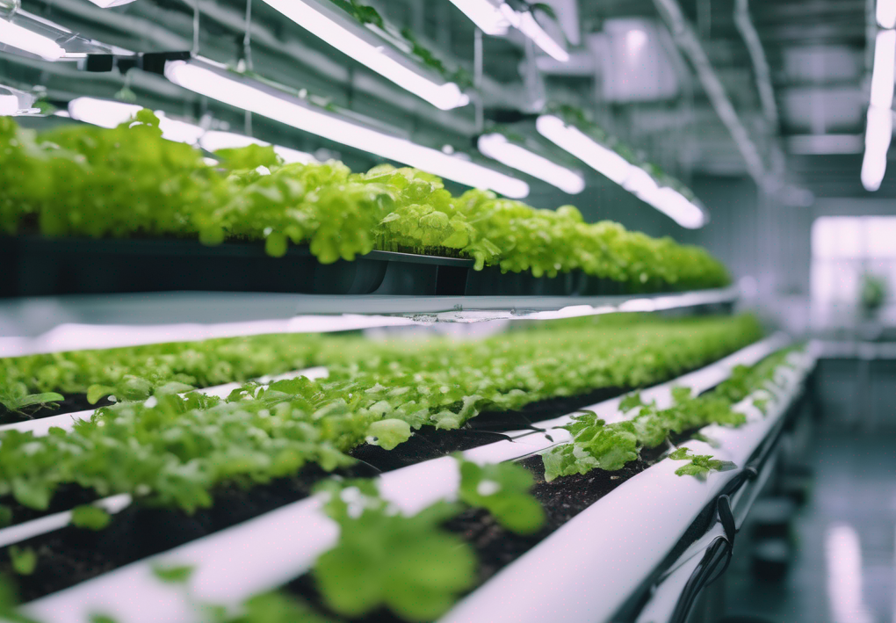

## Introduction

Every journey begins with a single step, and in my case, it was the quest for fresh herbs. Little did I know in 2019 that this seemingly small quest would evolve into a passionate endeavor into the world of hydroponics, taking me from initial failures to innovative solutions.

## A Quest for Freshness

Just before the world came to a standstill due to the COVID-19 lockdown, my culinary pursuits led me down a path I'd never expected. Tired of store-bought herbs and their questionable freshness, I decided to research hydroponic farming. The idea of cultivating plants without soil, providing them all the nutrients they need directly through water, seemed like a sustainable answer to my herb woes.

## Initial Hurdles

As fascinating as hydroponics was, it was by no means simple. The nuances of creating a balanced aquatic environment where plants could not just survive but thrive proved daunting. My first attempts were earnest but naive. Despite my best efforts, my plants didn't flourish. A deeper dive revealed that I had overlooked two crucial aspects: nutrient and pH levels. The imbalance of these elements in the water had stifled my plants, leading to their unfortunate demise.

## Embracing Technology

Rather than be disheartened, I saw this setback as a challenge waiting to be overcome. Leveraging my tech skills, I embarked on creating a sensor system using a Raspberry Pi. This system would monitor both the nutrient concentration and the pH levels of the water, ensuring an optimal environment for plant growth. It was a game-changer. Not only did it automate the monitoring process, but it also provided real-time insights, allowing for timely interventions. My plants were now thriving, and the fresh herbs I had longed for became a daily delight.

## Looking to the Future: Vertical Hydroponics

With the success of my small hydroponic setup, I now envision a larger, more ambitious project: vertical hydroponic farming. Given the limited land resources in places like Hawaii and the constant demand for fresh produce, vertical farming can revolutionize agriculture. It's sustainable, space-efficient, and with the integration of tech solutions like my Raspberry Pi sensor system, it can produce consistent yields.

## Conclusion

From the death of my first hydroponic plants to the birth of a tech-integrated solution, my journey in hydroponics has been enlightening. As I stand at the cusp of scaling up, I believe that with passion and innovation, we can reshape the future of farming, making it more sustainable and efficient.
