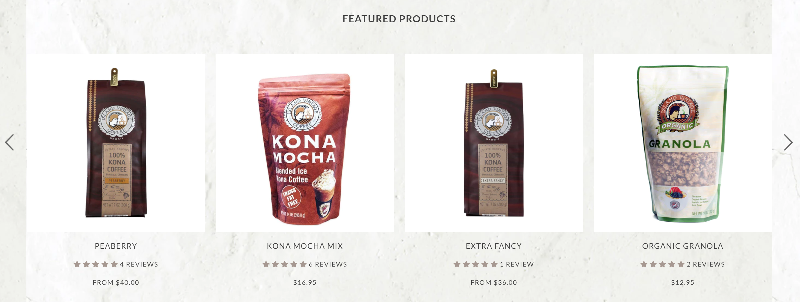
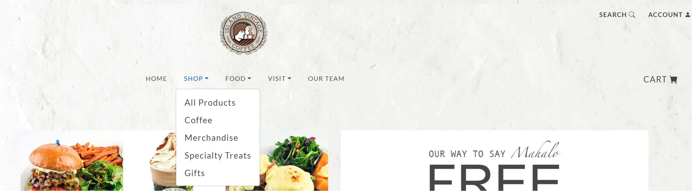
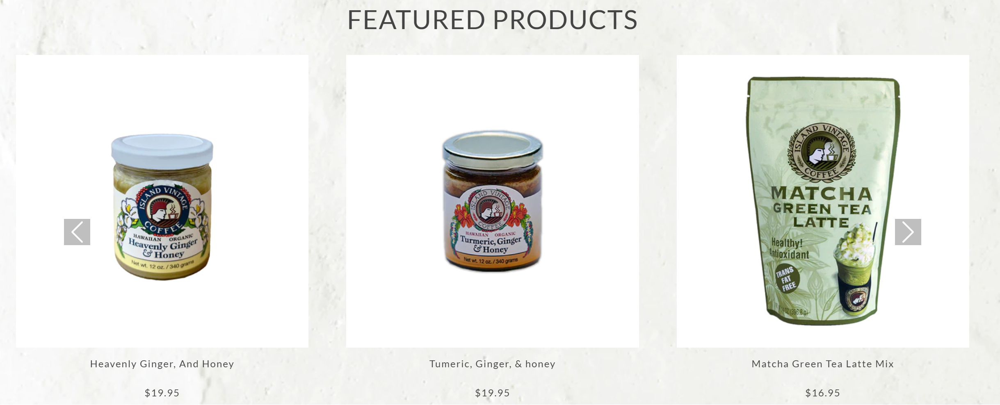

# A Discourse on UI Frameworks: Bootstrap 5 in Focus

## Introduction

In modern web development, User Interface (UI) frameworks are invaluable assets that significantly expedite the development process while ensuring a standardized output. Among these frameworks, Bootstrap 5 is widely recognized, offering a structured approach to web design. This essay explores the technical intricacies, advantages, and challenges associated with employing Bootstrap 5, in contrast to traditional methods utilizing raw HTML and CSS.

## Unveiling UI Frameworks

UI frameworks, like Bootstrap 5, provide a structured foundation for web development. They come equipped with a grid system and pre-built components, which facilitate a more efficient development process. However, mastering these features entails a learning curve, akin to acquiring proficiency in a new programming language.

## Bootstrap 5: A Technical Deep Dive

The ‘Island Snow’ project serves as a case study to elucidate the technical efficiencies rendered by Bootstrap 5. Initially, the project completion required 35 minutes; however, with subsequent iterations and increased familiarity with Bootstrap's grid system, the development time was reduced to 15 minutes. This significant reduction highlights the technical efficiency and speed that Bootstrap 5 can potentially offer.

## Comparative Assessment: Bootstrap 5 and Semantic UI

Diverging from Bootstrap's component-centric approach, Semantic UI emphasizes intuitive, semantic coding, thus offering a different development paradigm. While Bootstrap facilitates rapid deployment with pre-designed components, Semantic UI leans towards human-readable code, offering a more intuitive but less component-rich environment.

## Navigating Complex Projects: A Hybrid Approach

The exploration into more complex projects such as 'Suntory Whiskey' and 'Ferrari' demonstrated the limitations of Bootstrap 5 when intricate custom scripts and CSS were necessitated. In the ‘Island Vintage Coffee’ project, a hybrid approach was employed, blending Bootstrap 5 with custom coding to strive for a design closely resembling the desired outcome. While Bootstrap 5 expedited the developmental phase, achieving a precise design replica necessitated a deviation from the framework towards custom coding.

In the Suntory example, it's evident that there are a lot of custom Javascript and CSS. The drop-down menu has expanded the whole header, making it clear that replicating this with just bootstrap alone would be an arduous task, and crafting the custom code to achieve this would be time-consuming. However, once the code is crafted, it can be reused and customized for different menus.

I abandon this project after spending 3 hours trying to customize bootstrap navbar to do something similar. Although this may be due to my limited knowledge of Bootstrap 5, I feel like I can tackle this in CSS or similarly in a shorter amount of time. Suntory Whiskey wasn't the only project I abandone there were three other candidate, one used bootstrap and the other two had similar custom codes, fonts etc... as the Suntory Whiskey website.

## The Result Of This Exploration
The technical exploration through various projects underscores the balanced approach necessitated in modern web development. Bootstrap 5 emerges as a potent tool for rapid development, ensuring consistency and responsiveness in design. However, the quest for design precision, especially in complex projects, often calls for a foundational competency in HTML, CSS, and custom scripting. The analysis suggests a judicious blend of UI frameworks and custom coding as a pragmatic approach to navigating the intricate demands of contemporary web development projects.

### Original

## Reproduction

Admittedly, the navbar posed a significant challenge and consumed more time than anticipated, primarily due to my nascent understanding of Bootstrap's grid system. Conversely, the body section, comprising solely of images, was straightforward to construct. However, I encountered hurdles with the carousel item; the images didn't align correctly, text positioning was off, and the absence of the five-star icon added to the woes. Despite these challenges, transitioning to the footer was a relief. Its simplicity allowed for a swift completion in a mere 5 minutes.

## Retrospect

In reflection, the journey through employing Bootstrap 5 in these projects underscored a blend of efficiency, standardization, and also, the occasional stumbling blocks that come with the territory of learning a new framework. It highlighted the practical essence of having a robust understanding of the underlying grid system and the various components Bootstrap 5 offers. The hurdles faced served as a rich learning ground, paving the way towards a more nuanced appreciation of both the potential and the limitations embedded within UI frameworks.

Moreover, the projects demonstrated that while Bootstrap 5 can significantly streamline the development process, a complementary proficiency in custom coding remains indispensable for tackling unique design challenges. As the digital realm continues to evolve, being adept at harnessing the power of UI frameworks, while also retaining the flexibility to delve into custom code, emerges as a pragmatic and invaluable skill set for modern web developers. Through this analytical lens, the exploration into the world of Bootstrap 5 and UI frameworks at large, presents a compelling narrative of the dynamic interplay between standardization, customization, and the continual learning trajectory that web development encapsulates.