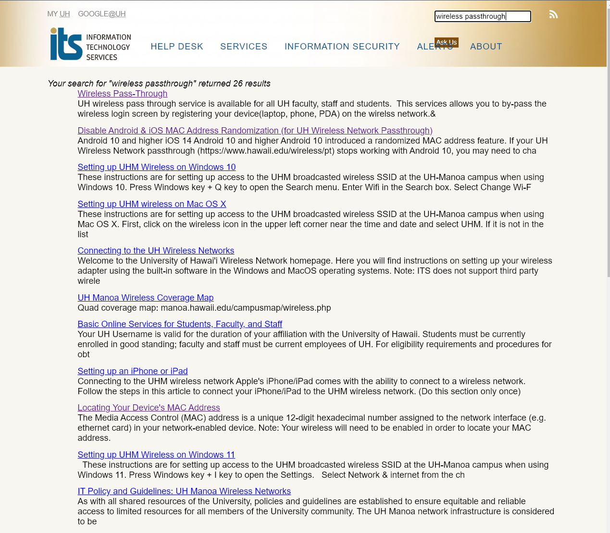

  

# UH ITS Ask Us AI Chatbot: A Technological Leap in User Support

## Introduction

Embarking on a journey to enhance the user experience on the UH ITS Ask Us support page, our team dedicated itself to developing the UH ITS Ask Us AI chatbot. This ambitious project was driven by the vision of transforming how users interact with our support services, making it more efficient, intuitive, and responsive. Recognizing the limitations of traditional search and query methods, we sought to create a solution that leverages the latest advancements in AI technology.

Our chatbot is not a mere incremental improvement over existing systems but represents a significant leap forward in user support technology. By integrating advanced natural language processing (NLP) techniques with the OpenAI API, our chatbot offers a nuanced understanding of user queries. It is designed to navigate a vast database of articles intelligently, providing not just accurate but contextually relevant answers to user inquiries.

This new approach to user support aims to streamline the information retrieval process significantly. Where traditional systems might struggle with the nuances of human language or provide generic responses, our AI-powered assistant excels in delivering precise and personalized support. It is a testament to our commitment to embracing cutting-edge technology to improve user experience continually.

## Project Inception

### Identifying the Need for Enhanced User Experience

The UH ITS Ask Us AI Chatbot project originated as part of the 2023 Hawaii Annual Code Challenge (HACC), a challenge titled "Ask Us" presented by the University of Hawaii, Information Technology Services. The central IT service, which operates a 24/7 Help Desk, sought to enhance its "Ask Us" online knowledge base used by a wide range of UH community members. Despite the availability of over 300 support articles, the current keyword search functionality varied in effectiveness, often depending on the user's familiarity with IT terminology and systems.

see the current setup the UH system have in place [Ask Us - University of Hawaii System](https://www.hawaii.edu/askus/)

  

### Conceptualizing the AI Chatbot

Addressing this challenge, we conceptualized an AI-powered chatbot solution to transcend the limitations of traditional keyword-based search systems. Our goal was to create a virtual assistant that could understand and interpret plain language questions, providing comprehensive, accurate, and contextually relevant answers. This concept aimed to improve access to existing information and empower users, especially those new to the UH community, to find answers more intuitively and efficiently.

### Laying the Groundwork

Garret Yoshimi, the subject matter contact for this challenge, underscored the need for a conversational UX powered by AI to enhance the search function of the Ask Us service. In response, our team embarked on meticulous planning and research, diving into various AI technologies and natural language processing techniques. This groundwork was crucial for developing a sophisticated chatbot that could interact with users in a flexible and intuitive manner, aligning with the project's goals of improving information access and reducing the dependency on human-assisted searches at the Help Desk.

### Technical Platforms and Data Utilization

The project was designed to leverage generative AI and AI-enabled chatbots, utilizing the extensive collection of Ask Us articles in HTML format available on the ITS public website. Our approach involved creating a solution roadmap that outlined the steps of user action and system response, focusing on delivering business value through improved accessibility of information and potential reductions in Help Desk tickets.

## Core Features and Technical Aspirations

### Harnessing the Power of OpenAI and Advanced NLP

Central to the UH ITS Ask Us AI Chatbot's functionality is the integration of the OpenAI API, a cornerstone in the realm of artificial intelligence. This integration is more than just a technical achievement; it represents a strategic choice to harness some of the most advanced AI capabilities available today. The OpenAI API provides our chatbot with the ability to process and understand natural language at a level that closely mirrors human comprehension. This is further enhanced by sophisticated natural language processing (NLP) techniques, enabling our chatbot to parse complex queries, determine intent, and respond in a way that feels natural and intuitive to users.

### Beyond Surface Content: Synthesizing Information

One of the most innovative aspects of our chatbot is its ability to go beyond merely retrieving information based on keywords. It synthesizes content from our extensive database, drawing on multiple articles to construct comprehensive and accurate responses. This capability sets our chatbot apart from conventional models, which often rely on surface-level matching of user queries to existing content. Our approach ensures that the chatbot understands the context and nuances of each query, providing responses that are not just factually accurate but also relevant to the user's specific needs.

### Adaptive Learning and Personalization

In addition to these capabilities, our chatbot is designed with adaptive learning algorithms. These algorithms enable the chatbot to learn from interactions with users, continually improving its accuracy and effectiveness. Over time, it becomes more adept at predicting and meeting users' needs, offering a personalized experience that evolves with each interaction. This feature is particularly important in an educational context, where users' queries can be diverse and complex.

### Technical Aspirations: Setting New Standards in AI Chatbots

Our technical aspirations for the UH ITS Ask Us AI Chatbot go beyond the current scope of the project. We aim to continually integrate emerging AI technologies and NLP advancements to enhance its capabilities further. Our goal is to set a new standard for AI chatbots in terms of responsiveness, accuracy, and user engagement. We envision a future where our chatbot not only answers queries but also anticipates user needs, contributing proactively to the learning and support experience.

## User-Centric Design and Functionality

### Personalized User Settings and History Tracking

A pivotal aspect of the UH ITS Ask Us AI Chatbot is its user-centric design, which is evident in features like personalized settings and history tracking. Recognizing that each user has unique needs and preferences, we implemented customization options that allow users to tailor their interactions according to their specific requirements. This personalization extends to tracking the user's interaction history, enabling the chatbot to provide more relevant and contextual responses over time. Such features not only enhance user experience but also build a sense of familiarity and efficiency in interactions.

### Streamlined Access to Information

Another key component of our design philosophy was to streamline access to information. The chatbot is adept at navigating through a vast array of frequently asked questions and support articles, allowing users to quickly find answers to their queries without the need to browse through multiple pages. This streamlined access is especially crucial in a support environment, where timely and accurate information can significantly impact user satisfaction and overall experience.

### Interactive and Engaging Chat Interface

The chatbot features an interactive and engaging chat interface, designed to be intuitive and user-friendly. We paid special attention to the chat interface's aesthetics and functionality, ensuring that users of all technical backgrounds could easily interact with the chatbot. The interface supports various types of interactions, including text inputs and clickable options, making it accessible and easy to use for a diverse user base.

This was what we came up with. 

  

### Advanced Functionalities for Administrative Users

In addition to catering to the needs of general users, the chatbot also offers advanced functionalities for administrative users. These include tools for monitoring chatbot performance, managing the knowledge base, and analyzing user interaction data. These functionalities provide administrators with valuable insights into user behavior and chatbot efficiency, enabling them to make informed decisions about system improvements and updates.

  

## Development Journey

### A Collaborative Effort in AI Integration

The development of the UH ITS Ask Us AI Chatbot, as part of the 2023 Hawaii Annual Code Challenge, was a collaborative effort that united a diverse team of developers, designers, and subject matter experts. My role in this project was particularly focused on designing and building the backend logic that forms the 'brain' of the chatbot. This involved integrating advanced AI capabilities from the OpenAI API into a user-friendly interface, a task that required both innovative thinking and technical proficiency.

### Crafting the Backend: Making the Chatbot Smart

My contribution to the project was grounded in conceptualizing and implementing the backend logic. I was responsible for creating the core functionality that enabled the chatbot to understand and intelligently respond to user queries. This involved writing intricate code that utilized natural language processing algorithms and AI models from OpenAI. One of my key tasks was to adapt these sophisticated technologies into a simplistic yet effective form that could be easily managed and scaled.

For example, I employed Meteor.js to construct a robust backend, ensuring seamless communication between the user interface and the AI processing unit. My approach was to use straightforward, yet powerful coding patterns that allowed for easy maintenance and future enhancements.

  

### Navigating Technical Challenges and Innovations

Throughout the development process, we encountered numerous technical challenges, one of which was ensuring the chatbot could accurately interpret and respond to a wide array of user queries, some of which were complex or ambiguously phrased. My focus was on refining the AI model based on real-world user interactions, continuously enhancing its ability to process and understand diverse queries.

### Breakthroughs in AI-Powered User Support

Each challenge led to significant breakthroughs in our chatbot's capabilities. The development of a more robust and flexible AI model, capable of handling various conversational scenarios, was a key achievement in my role. This advancement was crucial in providing more context-aware and user-specific responses, marking a pivotal moment in enhancing the chatbot's overall effectiveness and reliability.

### Building a Scalable and Sustainable System

Ensuring the scalability and sustainability of the chatbot system was a crucial aspect of my responsibilities. I focused on designing the backend architecture in a way that allowed for easy integration of new features and updates, thereby enabling the chatbot to evolve in line with changing user needs and technological advancements.

## Conclusion

The development journey of the UH ITS Ask Us AI Chatbot has been a testament to the transformative power of AI in enhancing user support services. Over the course of this project, we have not only realized our initial vision but also set new benchmarks in the realm of AI-powered support systems. Our chatbot represents a significant leap forward from traditional support mechanisms, offering users a more intuitive, efficient, and personalized experience.

In just a short span, this project has evolved from a concept to a fully functional prototype, demonstrating the potential of AI to revolutionize the way we approach user support. The integration of advanced natural language processing, the innovative use of the OpenAI API, and the emphasis on user-centric design have all contributed to creating a chatbot that is not only technologically advanced but also deeply attuned to the needs of its users.

Looking forward, we see the UH ITS Ask Us AI Chatbot as an evolving platform. We are committed to continuous improvement, aiming to integrate more features, enhance user interaction, and expand the scope of the chatbot's capabilities. Our future plans include the development of more sophisticated AI algorithms, the introduction of multilingual support, and the expansion of the chatbot's knowledge base to cover a broader range of topics.

As we reflect on this journey, we are inspired by the impact that our chatbot has already made and excited about its future potential. We believe that the UH ITS Ask Us AI Chatbot will continue to play a pivotal role in reshaping user support at the University of Hawaii, paving the way for more innovative uses of AI in educational and support services.

## Acknowledgments

### Project Page
[Regex-ICS314](https://regex-ics314.github.io/)

  <section class="section hero is-light" id="team-members">
    

      

        

          <h3 class="title is-3">Team Members</h3>
          

            <h4 class="title is-4"><a href="https://imamuradev.github.io/">Devin I.</a></h4>
            <h4 class="title is-4"><a href="https://jerrethdiaz.github.io/">Jerreth D.</a></h4>
            <h4 class="title is-4"><a href="https://josephaverion.github.io/">Joseph A.</a></h4>
            <h4 class="title is-4"><a href="https://thanhly1.github.io/">Thanh L.</a></h4>
          

        

      

    

  </section>